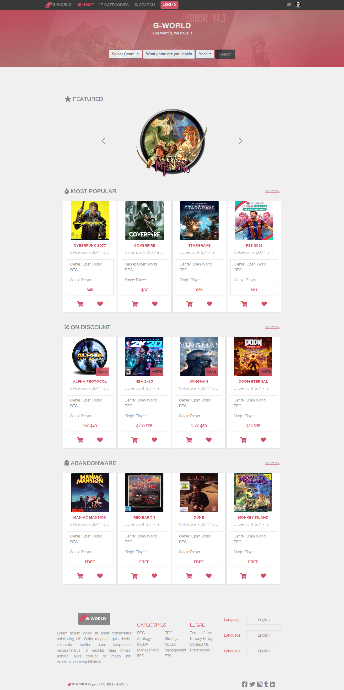

# G-World: Games Store (HTML-Capstone)

> Capstone Project of the HTML/CSS section where technologies learned so far are applied to a game online store.

## Built With

- HTM5 & CSS

## Live Demo

[Live Demo Link](https://srizzuto.github.io/HTML-Capstone/)

## Getting Started

To get a local copy up and running follow these simple example steps.

Go to https://github.com/srizzuto/HTML-Capstone/

1. Click on the code and copy the HTML code.
2. Use terminal to clone this repository on your local machine.
3. Run <code>git checkout -b your-branch-name</code>. Make your contributions.
4. Push your branch up to your forked repository.
5. Open a Pull Request with a detailed description of the development branch of the original project for a review.

## Author

👤 **Sebastian Rizzuto**

- GitHub: [@srizzuto](https://github.com/srizzuto)
- Twitter: [@sbstnrzzt](https://twitter.com/sbstnrzzt)
- LinkedIn: [Sebastian Rizzuto](https://www.linkedin.com/in/srizzuto/)
## Contributing

Contributions, issues, and feature requests are welcome!

Feel free to check the [issues page](https://github.com/srizzuto/using-bootstrap/issues).

## Show your support

Give a ⭐️ if you like this project!

## Acknowledgments

- To my Stand Up Team who kept my morale up!

